[TOC]

# 第一章

## Web标准：是敌还是友

### 浏览器前缀

每个浏览器都可以实现 这些实验性的(甚至是私有的、非标准的)特性，但要在名称前面加上自 己特有的前缀。

只是给开发者尝试的新特性，如果后续被采用，是不需要使用带前缀的特性的。但是浏览器前缀被滥用，导致很多特性都加上了浏览器后缀，加大了维护成本。

目前的解决方案：这些实验性特性需要通过配置开关来启用，这可以有效防止开 发者在生产环境中使用它们，因为你不能要求用户为了正确地浏览你的网站 而去修改浏览器设置


# 第二章

## 背景和边框

### 1、半透明边框

通常我们都是在background属性使用rgba()和hsla()，但是在边框中使用半透明颜色时，会发现边框背后会有背景色，如下：

```css
border: 10px solid hsla(0,0%,100%,.5);
background: white;
```

解决方案：

​		在 CSS 2.1 中，这就是背景的工作原理。我们只能接受它并且向前看。 谢天谢地，从背景与边框(第三版)(http://w3.org/TR/css3-background)开 始，我们可以通过 background-clip 属性来调整上述默认行为所带来的不 便。这个属性的初始值是 border-box，意味着背景会被元素的 border box(边框的外沿框)裁切掉。如果不希望背景侵入边框所在的范围，我们要做的就是把它的值设为 padding-box，这样浏览器就会用内边距的外沿来把背景裁切掉。

即background默认包含border的位置，修改代码如下就可解决：

```css
border: 10px solid hsla(0,0%,100%,.5);
background: white;
background-clip: padding-box;
```

### 2、多重边框

#### box-shadow 方案

box-shadow: *h-shadow v-shadow blur spread color* inset;

如上，box-shadow接受第四个参数扩张半径，通过指定正值或负值，可以让投影面积加大或者减小。一个正值的扩张半径加 上两个为零的偏移量以及为零的模糊值，得到的“投影”其实就像一道实线边框，如图：

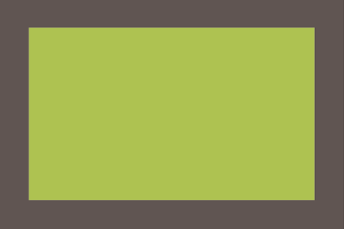

```css
background: yellowgreen; 
box-shadow: 0 0 0 10px #655;
```

这样，我们就可以利用box-shadow的逗号分隔语法，设置任意数量的投影：


```css
background: yellowgreen;
box-shadow: 0 0 0 10px #655, 0 0 0 15px deeppink;
```

唯一需要注意的是，box-shadow 是层层叠加的，第一层投影位于最顶层，依次类推。如果你愿意，甚至还可以在这些“边框”的底下再加一 层常规的投影:

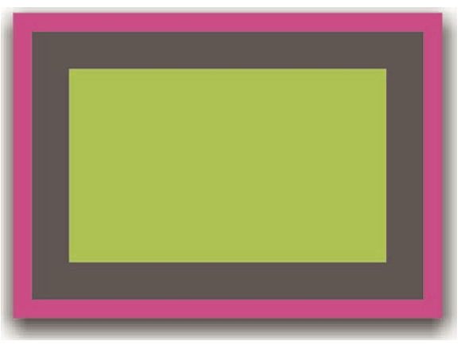

```css
background: yellowgreen; 
box-shadow: 0 0 0 10px #655,
            0 0 0 15px deeppink,
            0 2px 5px 15px rgba(0,0,0,.6);
```

多重投影解决方案在绝大多数场合都可以很好地工作，但有一些注意事项。

- 投影的行为跟边框不完全一致，因为它不会影响布局，而且也不会 受到 box-sizing 属性的影响。不过，你还是可以通过内边距或外边距(这取决于投影是内嵌和还是外扩的)来额外模拟出边框所需要占据的空间。
- 上述方法所创建出的假“边框”出现在元素的外圈。它们并不会响 应鼠标事件，比如悬停或点击。如果这一点非常重要，你可以给 box-shadow属性加上inset关键字，来使投影绘制在元素的内圈。 请注意，此时你需要增加额外的内边距来腾出足够的空隙。

#### outline 方案

在某些情况下，你可能只需要两层边框，那就可以先设置一层常规边 框，再加上 outline(描边)属性来产生外层的边框。这种方法的一大优 点在于边框样式十分灵活，不像上面的 box-shadow 方案只能模拟实线边框(假设我们需要产生虚线边框效果，box-shadow 就没辙了)。

```css
background: yellowgreen; 
border: 10px solid #655; 
outline: 5px solid deeppink;
```

描边的另一个好处在于，你可以通过 outline-offset 属性来控制它跟元素边缘之间的间距，这个属性甚至可以接受负值。这对于某些效果来说非 常有用，如下：

```css
background: yellowgreen; 
border: 10px solid #655; 
outline: 5px dashed #fff;
outline-offset: -10px;
```

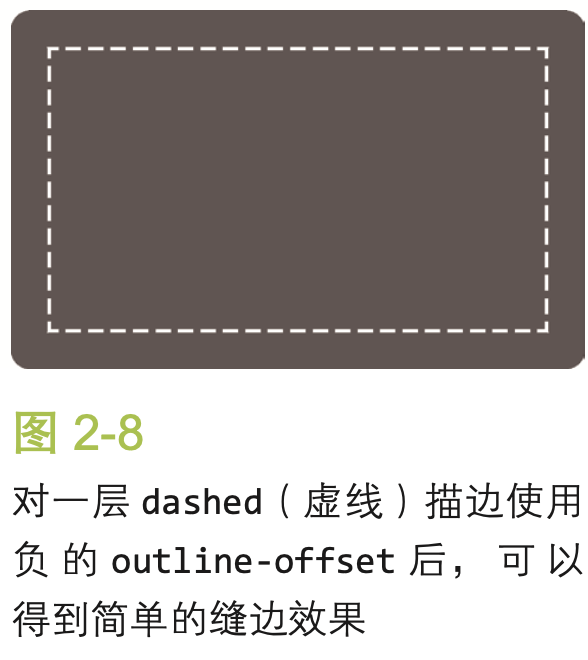

这个方案同样也有一些需要注意的地方：

- 如上所述，它只适用于双层“边框”的场景，因为 outline 并不能 接受用逗号分隔的多个值。如果我们需要获得更多层的边框，前一 种方案就是我们唯一的选择了。
- 边框不一定会贴合 border-radius 属性产生的圆角，因此如果元素 是圆角的，它的描边可能还是直角的。请注意，这种行 为被 CSS 工作组认为是一个 bug，因此未来可能会改为贴合 border- radius 圆角。
- 根据 CSS 基本 UI 特性(第三版)规范(http://w3.org/TR/css3-ui)所 述，“描边可以不是矩形”。尽管在绝大多数情况下，描边都是矩形 的，但如果你想使用这个方法，请切记:最好在不同浏览器中完整 地测试最终效果。

### 3、灵活的背景定位

#### background-position 的扩展语法

在 CSS 背景与边框(第三版)(http://w3.org/TR/css3-background)中， background-position 属性已经得到扩展，它允许我们指定背景图片距离任 意角的偏移量，只要我们在偏移量前面指定关键字。举例来说，如果想让背 景图片跟右边缘保持 20px 的偏移量，同时跟底边保持 10px 的偏移量，可以这样做:

Tip: background-size: contain 代表图片缩放至全部显示在背景上。background-size: cover 代表图片缩放至整个覆盖背景。

```css
background: url(code-pirate.svg) no-repeat #58a; 
background-position: right 20px bottom 10px;
```

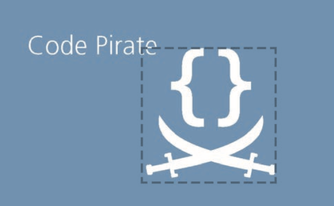

最后一步，我们还需要提供一个合适的回退方案。因为对上述方案来 说，在不支持 background-position 扩展语法的浏览器中，背景图片会紧 贴在左上角(背景图片的默认位置)。这看起来会很奇怪，而且它会干扰到 文字的可读性。提供一个回退方案也很简单，就是把老套的 bottom right 定位值写进 background 的简写属性中:

```css
background: url(code-pirate.svg) no-repeat bottom right #58a;
background-position: right 20px bottom 10px;
```

#### background-origin

在给背景图片设置距离某个角的偏移量时，有一种情况极其常见:偏移 量与容器的内边距一致。如果采用上面提到的 background-position 的扩 展语法方案，代码看起来会是这样的:

```css
padding: 10px;
background: url(code-pirate.svg) no-repeat #58a; 
background-position: right 10px bottom 10px;
```


但是每次改动内边距的值时，我们都需要在三个地方更新这个值。 background-origin在默认情况下，它的值是padding-box。如果把它的值改成 content-box(参见下面的代码)，我们在 background-position 属 性中使用的边角关键字将会以内容区的边缘作为基准(也就是说，此时背景 图片距离边角的偏移量就跟内边距保持一致了):

```css
padding: 10px;
background: url("code-pirate.svg") no-repeat #58a bottom right; /* 或 100% 100% */ 
background-origin: content-box;
```

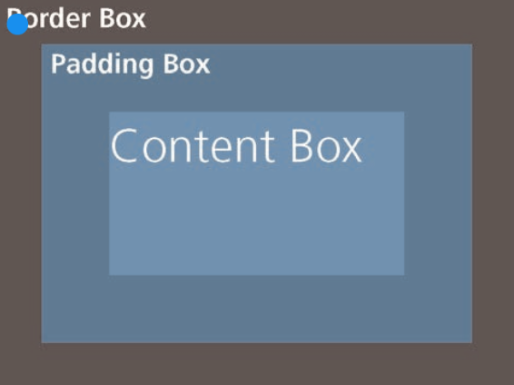

#### calc() 

把背景图片定位到距离底边 10px 且 距离右边 20px 的位置。如果我们仍然以左上角偏移的思路来考虑，其实 就是希望它有一个 100% - 20px 的水平偏移量，以及 100% - 10px 的垂直 偏移量。calc() 函数允许我们执行此类运算，它可以完美地在 background-position 属性中使用:

```css
background: url("code-pirate.svg") no-repeat; 
background-position: calc(100% - 20px) calc(100% - 10px);
```

### 4、边框内圆角

有时我们需要一个容器，只在内侧有圆角，而边框或描边的四个角在外 部仍然保持直角的形状，如图 2-15 所示。这是一个有趣的效果，目前还没 有被滥用。用两个元素可以实现这个效果，这并没有什么特别的:

相关规范

图 2-15 容器外围有一道边框，但只在内 侧有圆角

<div class="something-meaningful"><div> I have a nice subtle inner rounding, don't I look pretty?

```html
<div class="something-meaningful"><div> 
  I have a nice subtle inner rounding, don't I look pretty?
</div></div>

.something-meaningful { 
	background: #655; 
	padding: .8em;
}

.something-meaningful > div { 
	background: tan;
	border-radius: .8em;
	padding: 1em; 
}
```

这个方法很好，但要求我们使用两个元素，而我们只需要一个元素。有 没有办法可以只用一个元素达成同样的效果呢?（用box-shadow覆盖圆角旁空余部分颜色）

```css
background: tan; 
border-radius: .8em; 
padding: 1em;
box-shadow: 0 0 0 .6em red; 
outline: .6em solid #655;
```

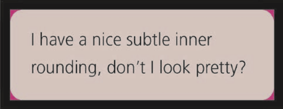

### 5、条纹背景

假设我们有一条基本的垂直线性渐变，颜色从#fb3 过渡到#58a

```css
background: linear-gradient(#fb3, #58a);
```

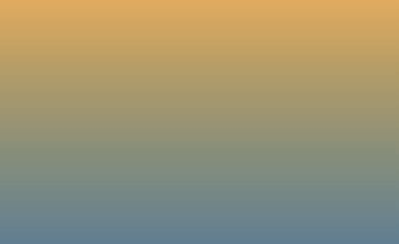

现在，让我们试着把这两个色标拉近一点:

```css
background: linear-gradient(#fb3 20%, #58a 80%);
```

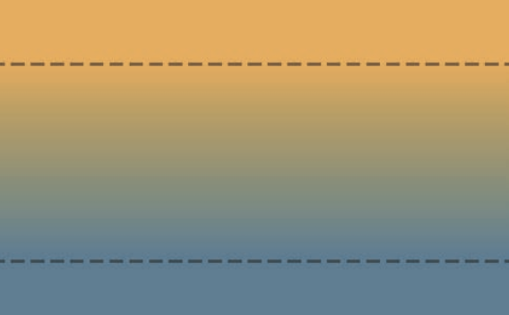

如果我们把两个色标重合在一起， 会发生什么?

```css
background: linear-gradient(#fb3 50%, #58a 50%);
```


“如果多个色标具有相同的位置，它们会产生一个无限小的过渡区域， 过渡的起止色分别是第一个和最后一个指定值。从效果上看，颜色会在那 个位置突然变化，而不是一个平滑的渐变过程。”

如上图所示，已经没有任何渐变效果了，只有两块实色， 各占据了 background-image 一半的面积。本质上，我们已经创建了两条巨 大的水平条纹。

因为渐变是一种由代码生成的图像，我们能像对待其他任何背景图像那 样对待它，而且还可以通过 background-size 来调整其尺寸:

```css
background: linear-gradient(#fb3 50%, #58a 50%); 
background-size: 100% 30px;
```


在图 2-24 中可以看到，我们把这两条条纹的高度都缩小到了 15px。由 于背景在默认情况下是重复平铺的，整个容器其实已经被填满了水平条纹

(参见图 2-25)。我们还可以用相同的方法来创建不等宽的条纹，只需调整色标的位置值 即可:

```css
background: linear-gradient(#fb3 30%, #58a 30%); 
background-size: 100% 30px;
```


为了避免每次改动条纹宽度时都要修改两个数字，我们可以再次从规范 那里找到捷径。

“如果某个色标的位置值比整个列表中在它之前的色标的位置值都要 小，则该色标的位置值会被设置为它前面所有色标位置值的最大值。”

这意味着，如果我们把第二个色标的位置值设置为 0，那它的位置就 总是会被浏览器调整为前一个色标的位置值，这个结果正是我们想要的。 因此，下面的代码会产生跟上图 完全一样的条纹背景，但代码会更加 DRY:

```css
background: linear-gradient(#fb3 30%, #58a 0);
background-size: 100% 30px;
```

如果要创建超过两种颜色的条纹，也是很容易的。举例来说，下面的代 码可以生成三种颜色的水平条纹:

```css
background: linear-gradient(#fb3 33.3%, #58a 0, #58a 66.6%, yellowgreen 0);
background-size: 100% 45px;
```

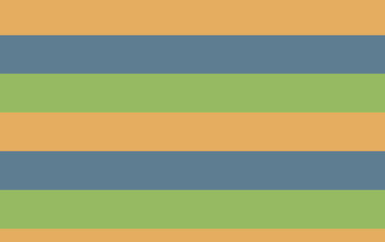

#### 垂直条纹

水平条纹是最容易用代码写出来的，但我们在网页上看到的条纹图案并 不都是水平的。有些条纹是垂直的(参见图 2-28)，而且某些形态的斜条纹 或许更受欢迎，或者看起来更加有趣。幸运的是，CSS 渐变同样也能帮助我 们创建出这些效果，只是难度稍有不同。

垂直条纹的代码跟水平条纹几乎是一样的，差别主要在于:我们需要在 开头加上一个额外的参数来指定渐变的方向。在水平条纹的代码中，我们其 实也可以加上这个参数，只不过它的默认值to bottom本来就跟我们的意 图一致，于是就省略了。最后，我们还需要把 background-size 的值颠倒 一下，原因应该不用多说了吧:

```css
background: linear-gradient(to right, /* 或 90deg */ #fb3 50%, #58a 0);
background-size: 30px 100%;
```

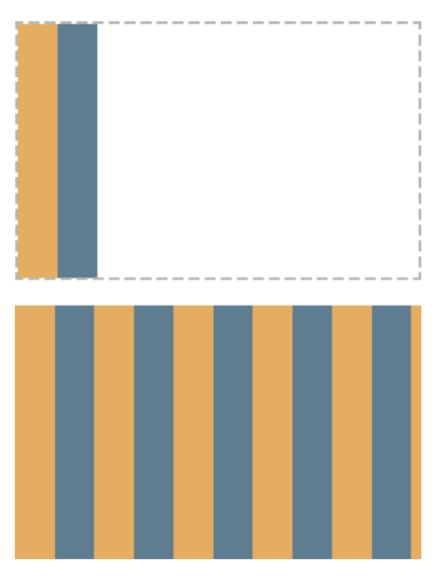

#### 斜向条纹

在完成了水平和垂直条纹之后，我们可能会顺着往下想:如果我们再次 改变 background-size 的值和渐变的方向，是不是就可以得到斜向(比如 45°)的条纹图案呢?比如这样(结果如图 2-29 所示):

```css
background: linear-gradient(45deg,#fb3 50%, #58a 0); 
background-size: 30px 30px;
```


可以发现，这个办法行不通。原因在于我们只是把每个“贴片”1 1内部的 渐变旋转了 45°，而不是把整个重复的背景都旋转了。试着回忆一下我们以 前用位图来生成斜向条纹时是怎么做的吧，做法类似图 2-30。单个贴片包 含了四条条纹，而不是两条，只有这样才有可能做到无缝拼接。它正是我们 需要在 CSS 代码中重新实现的贴片，因此我们需要增加一些色标:

```css
background: linear-gradient(45deg,
#fb3 25%, #58a 0, #58a 50%,
#fb3 0, #fb3 75%, #58a 0); 
background-size: 30px 30px;
```

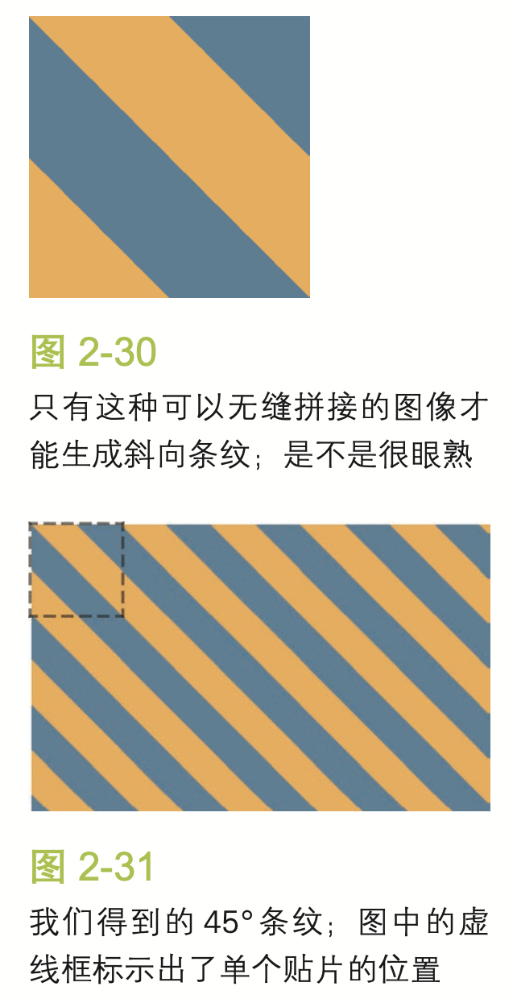

#### 更好的斜向条纹

在前面的段落中展示的方法还不够灵活。假设我们想让条纹不是 45°而是 60°怎么办?或者是 30°?又或者是 3.141 592 653 5°?如果我们只是把渐 变的角度改一下，那么结果看起来会相当糟糕。(比如在图 2-34 中，我们尝 试实现 60°条纹，但以失败告终。)

幸运的是，我们还有更好的方法来创建斜向条纹。一个鲜为人知的真
 相是 linear-gradient() 和 radial-gradient() 还各有一个循环式的加强 版:repeating-linear-gradient() 和 repeating-radial-gradient()。它们的工作方式跟前两者类似，只有一点不同:色标是无限循环重复的，直到填满整个背景。下面是一个重复渐变的例子(效果参见图 2-35):

```css
background: repeating-linear-gradient(45deg, #fb3, #58a 30px);
```

它相当于下面这个简单的线性渐变:

```css
background: linear-gradient(45deg, #fb3, #58a 30px,
              #fb3 30px, #58a 60px,
              #fb3 60px, #58a 90px,
              #fb3 90px, #58a 120px,
              #fb3 120px, #58a 150px, ...);
```

重复线性渐变完美适用于——你已经猜到了吧——条纹效果!这得益于 它们可以无限循环的天赋，一个渐变图案就可自动重复并铺满整个背景。因 此，我们再也不需要去操心如何创建出可以无缝拼接的贴片了。

我们苦苦追寻的 60°条纹只需这样写即可:

```css
background: repeating-linear-gradient(60deg,
#fb3, #fb3 15px, #58a 0, #58a 30px);
```

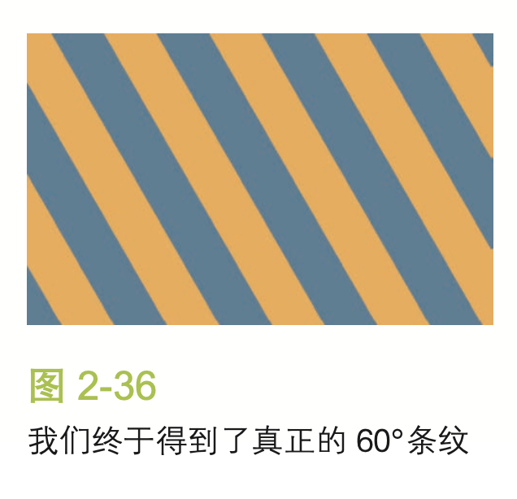

#### 灵活的同色系条纹

在大多数情况下，我们想要的条纹图案并不是由差异极大的几种颜色组 成的，这些颜色往往属于同一色系，只是在明度方面有着轻微的差异。举个 例子，我们来看看这个条纹图案:

```css
background: repeating-linear-gradient(30deg, #79b, #79b 15px, #58a 0, #58a 30px);
```


在图 2-37 中可以看到，条纹是由一个主色调( 变体所组成的。但是，这两种颜色之间的关系在代码中并没有体现出来。此 外，如果我们想要改变这个条纹的主色调，甚至需要修改四处!

幸运的是，还有一种更好的方法:不再为每种条纹单独指定颜色，而是 把最深的颜色指定为背景色，同时把半透明白色的条纹叠加在背景色之上来 得到浅色条纹:

```css
background: #58a;
background-image: repeating-linear-gradient(30deg,
                    hsla(0,0%,100%,.1),
                    hsla(0,0%,100%,.1) 15px,
                    transparent 0, transparent 30px);
```

### 6、复杂的背景图案

#### 网格

只使用一个渐变时，我们能创建的图案并不多。当我们把多个渐变图 案组合起来，让它们透过彼此的透明区域显现时，神奇的事情就发生了。按 照这个思路，我们首先想到的可能就是把水平和垂直的条纹叠加起来，从而 得到各种样式的网格。举例来说，下面的代码会创建如图 2-39 所示的桌布(方格纹)图案。

```css
background: white;
background-image: linear-gradient(90deg,
                    rgba(200,0,0,.5) 50%, transparent 0),
                  linear-gradient(
rgba(200,0,0,.5) 50%, transparent 0); background-size: 30px 30px;
```

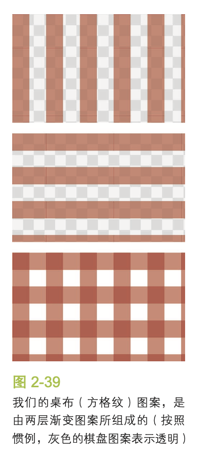

在某些情况下，我们希望网格中每个格子的大小可以调整，而网格线条 的粗细同时保持固定。举例来说，类似图纸辅助线的网格就是这种情况。这 是一个非常好的例子，展示了使用长度而不是百分比作为色标的场景:

```css
background: #58a; background-image:
    linear-gradient(white 1px, transparent 0),
linear-gradient(90deg, white 1px, transparent 0);
background-size: 30px 30px;
```

我们得到的结果就是一幅用 1px 白线画出来的 30px 大小的网格图案 (参见图 2-40)。与“灵活的同色系条纹”一节中的例子类似，主色调在这

里也起到了回退颜色的作用。


利用这个还可以实现更多的效果：

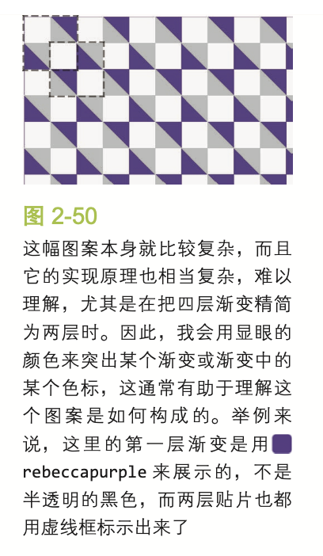


### 7、伪随机背景

为了更真实地模拟条纹的随机性，我们接下来可能会想到，把这组条纹 从一个平面拆散为多个图层:一种颜色作为底色，另三种颜色作为条纹，然 后再让条纹以不同的间隔进行重复平铺。这一点不难做到，我们在色标中定 好条纹的宽度，再用 **background-size** 来控制条纹的间距。代码看起来可 能是这样的:

```css
background: hsl(20, 40%, 90%); background-image:
    linear-gradient(90deg, #fb3 10px, transparent 0),
    linear-gradient(90deg, #ab4 20px, transparent 0),
    linear-gradient(90deg, #655 20px, transparent 0);
background-size: 80px 100%, 60px 100%, 40px 100%;
```


因为最顶层贴片1 1 我们应该把平铺间距最大的贴片安排在最顶层(在我们的例子中是橙色条 纹)。

在图 2-54 中可以看到，这样的结果显明更有随机的感觉;但如果仔细 观察的话，仍然可以看出图案每隔 240px 就会重复一次。这个组合图案中第 一个贴片的终点，就是各层背景图像以不同间距重复数次后再次统一对齐的 点。让我们再次穿越回初中数学课堂:如果我们有一些数字，那么可以同时 整除所有数字的最小数字就叫作它们的最小公倍数(LCM)。因此，这里贴 片的尺寸实际上就是所有 background-size 的最小公倍数，而 40、60 和 80 的最小公倍数正是 240。

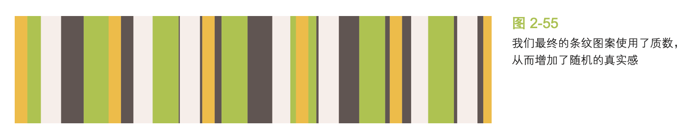

根据这个逻辑，要让这种随机性更加真实，我们得把贴片的尺寸最大 化。感谢数学，我们不需要苦苦思索如何做到这一点，因为我们已经知道答 案了。为了让最小公倍数最大化，这些数字最好是“相对质数”11。在这种情 况下，它们的最小公倍数就是它们的乘积。举例来说，3、4 和 5 是相对质 数，因此它们的最小公倍数就是 3×4×5=60。要达成相对质数，最简单的办 法就是尽量选择质数，因为质数跟其他任意数字都是相对质数。在网上可以 找到质数的清单，它们有的非常大。

为了进一步增加随机性，我们甚至可以用质数来指定各组条纹的宽度。 于是我们的代码变为:

```css
background: hsl(20, 40%, 90%); background-image:
    linear-gradient(90deg, #fb3 11px, transparent 0),
    linear-gradient(90deg, #ab4 23px, transparent 0),
    linear-gradient(90deg, #655 41px, transparent 0);
background-size: 41px 100%, 61px 100%, 83px 100%;
```

### 8 连续的图像边框

参照：https://blog.csdn.net/qq_41903941/article/details/90259306


# 第三章

### 9、自适应的椭圆

给任何正方形元素设置一个足够大的border- radius，就可以把它变成一个圆形。所用到的 CSS 代码如下所示:

```css
background: #fb3;
width: 200px;
height: 200px;
border-radius: 100px; /* >= 正方形边长的一半 */
```


你可能还注意到了，如果指定任何大于 100px 的半径，仍然可以得到一 个圆形。规范特别指出了这其中的原因:

“当任意两个相邻圆角的半径之和超过 border box 的尺寸时，用户 代理必须按比例减小各个边框半径所使用的值，直到它们不会相互重叠 为止。”

说到 border-radius，有一个鲜为人知的真相:它可以单独指定水平 和垂直半径，只要用一个斜杠(/)分隔这两个值即可。这个特性允许我 们在拐角处创建椭圆圆角(参见图 3-3)。因此，如果我们有一个尺寸为 200px×150px 的元素，就可以把它圆角的两个半径值分别指定为元素宽高的 一半，从而得到一个精确的椭圆:

```css
border-radius: 100px / 75px;
```

