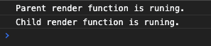
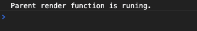
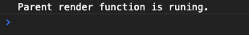

[TOC]


# react PureComponent和React.memo的简单作用

> PureComponent 和 React.memo的作用都是为了性能优化而出现的，目的是减少组件不必要的渲染。区别是PureComponent是作用在class 组件，React.memo是作用在函数组件。

## PureComponent

先来看个简单例子：

```
class Child extends React.Component {
  render() {
    console.log('Child render function is runing.');
    return <div>Child</div>;
  }
}

class Parent extends React.Component {
  state = {
    num: 1,
  };
  handleClick = () => {
    this.setState(state => ({
      num: state.num + 1,
    }));
  };

  render() {
    console.log('Parent render function is runing.');
    return (
      <>
        <button type="primary" onClick={this.handleClick}>
          click to change{this.state.num}
        </button>
        <Child />
      </>
    );
  }
}
```

页面很简单，就一个按钮，和只有文本的子组件，父子组件没有任何通信：


当我们点击按钮的时候，会发现父组件和子组件的render函数都被触发了：



但是父子组件之间是没有任何通信的，子组件的渲染函数不应该被执行的，这时候我们可以优化一下代码，把Child组件改成继承React.PureComponent:

```

class Child extends React.PureComponent {
  render() {
    console.log('Child render function is runing.');
    return <div>Child</div>;
  }
}
```

这时候我们再次点击按钮，会发现子组件的render函数不会触发了：


然后，当我们把数字作为props传给Child，修改代码为下面：

```
<Child props={this.state.num} />
```

这时候再次点击按钮，会发现子组件的render函数又会触发了：


这时候，我们可以继续优化Child组件，并再次点击按钮：

```
class Child extends React.PureComponent {
  shouldComponentUpdate() {
    return false;
  }
  render() {
    console.log('Child render function is runing.');
    return <div>Child</div>;
  }
}
```



子组件没用到的props改变也不会更新了，当然shouldComponentUpdate还是要按实际需要去写，这里直接返回false，后面render函数都不会再被触发了。


## React.memo

我们把上面代码改成函数组件：

```
function Child() {
  console.log('Child render function is runing.');
  return <div>Child</div>;
}

function Parent() {
  const [num, setNum] = useState(0);
  function handleClick() {
    setNum(num + 1);
  }

  console.log('Parent render function is runing.');
  return (
    <>
      <button type="primary" onClick={handleClick}>
        click to change{num}
      </button>
      <Child />
    </>
  );
}
```

这时候点击按钮，父子组件都触发了渲染：


这时候我们只需要修改子组件：

```
function ChildFn() {
  console.log('Child render function is runing.');
  return <div>Child</div>;
}
const Child = React.memo(ChildFn);
```

再次点击按钮，子组件不再触发渲染了：



若传了props给子组件，子组件同样会触发渲染。

## 结语

PureComponent和React.memo都是为了性能优化而出现的，写代码时必须多考虑性能优化