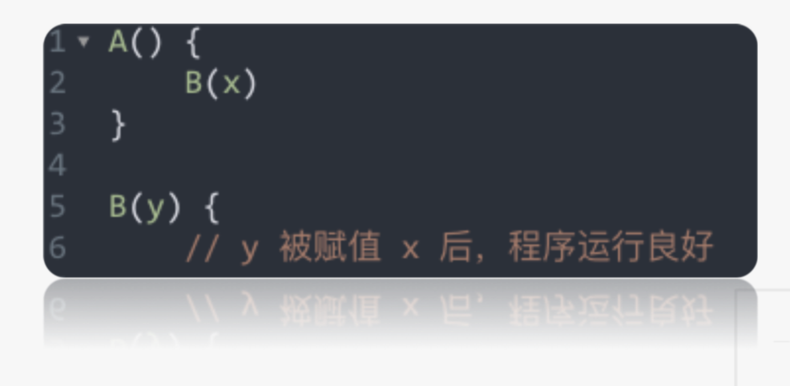
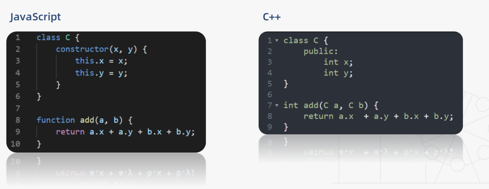
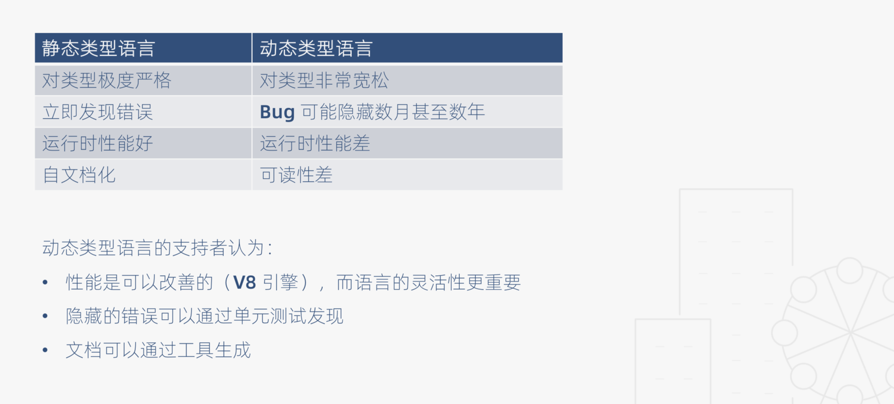
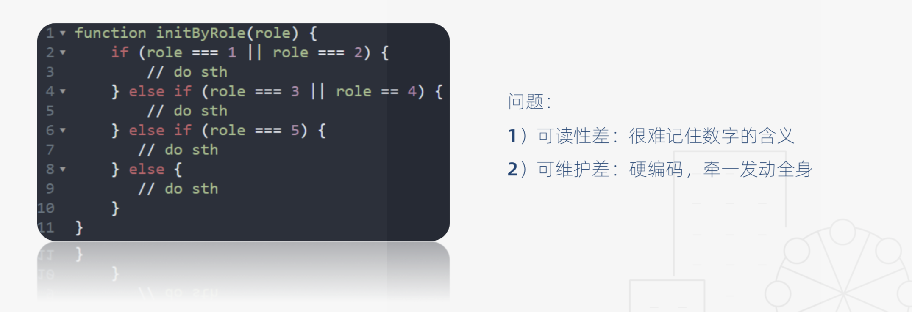
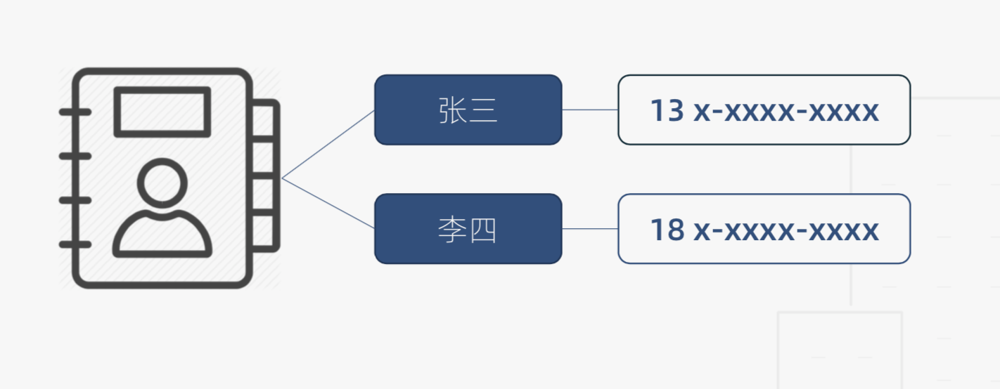

# TypeScript 学习笔记

[TOC]

## 前言

如今如此广阔的应用领域，对JavaScript 语言的安全性、健壮性和可维护性有更高的要求。尽管ECMAScript标准在近几年有了长足的进步，但在类型检查方面依然无所建树。例如这些场景：

1. 调用别人写的函数，没有任何注释，为了搞清楚类型，只能硬着头皮看函数逻辑
2. 为了保证代码的健壮性，对一个函数的输入参数进行各种假设（类型判断）
3. 维护底层库时，修改参数类型，但是不知道有哪些地方使用

以上情况，归根结底是因为JavaScript是一门动态弱类型语言，对变量的类型非常宽容，而且不会在这些变量和它们的调用者之间建立结构化的契约。如果长期在没有类型约束的环境下开发，就会造成**类型思维**的缺失，养成不良的编程习惯。

TypeScript就是致力于为JavaScript提供静态类型检查。

## 1、什么是TypeScript？

根据官方的定义，它是拥有类型系统的JavaScript的超集，可以编译成纯JavaScript。

#### TypeScript的特点：

1. TypeScript会在编译代码时，进行严格的静态类型检查

   > 这意味着你可以在编码的阶段发现可能存在的隐患，而不必把它们带到线上去

2. 语言扩展

   > TS会包括来自ES6和未来提案中的特性，比如异步操作和装饰器，也会从其他语言借鉴某些特性，比如接口和

3. 工具属性

   > TS可以编译成标准的JavaScript，可以在任何浏览器、操作系统上运行

#### 使用TypeScript 的其他好处

- 接口定义代替文档
- IDE能够提高开发效率，降低维护成本
- 重塑“类型思维”


## 2、强类型与弱类型

### 强类型语言

在强类型语言中，当一个对象从调用函数传递到被调用函数时，其类型必须与被调用函数中声明的类型兼容。

```text
<p align="right">—— Liskov, Zilles 1974</p>
```



##### 通俗定义

强类型语言不允许改变变量的数据类型，除非进行强制类型转换


### 弱类型语言

在弱类型语言中，变量可以被赋予不同的数据类型


## 3、静态类型语言与动态类型语言

### 通俗定义

静态类型语言：在编译阶段确定所有变量的类型

动态类型语言：在执行阶段确定所有变量的类型



### JavaScript与C++对比


### 静态类型与动态类型对比



## 4、基本类型


#### 类型注解

作用：相当于强类型语言中的类型声明

语法：(变量/函数):type

### 枚举类型

##### 一个角色判断的例子



##### 枚举的定义：一组有名字的常量集合

