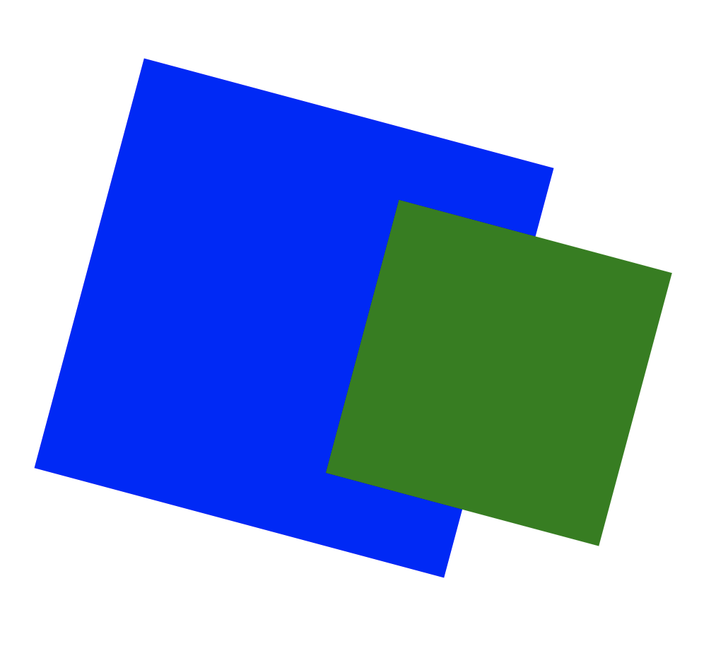
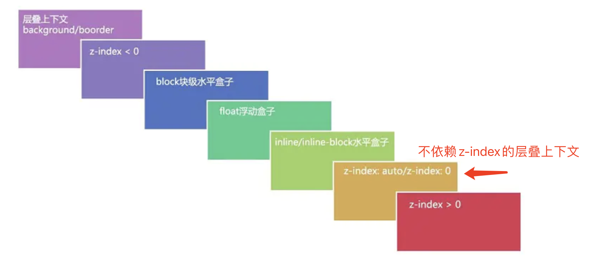

# CSS中的层叠上下文和层叠顺序

# **一、什么是层叠上下文**

层叠上下文是一个概念，跟「[块状格式化上下文(BFC)](http://www.zhangxinxu.com/wordpress/?p=4588)」类似。说到层叠上下文，大家可能会想到CSS中的`z-index`属性，需要跟大家讲的是，`z-index`实际上只是CSS层叠上下文和层叠顺序中的一叶小舟。

> 层叠上下文，英文称作”stacking context”. 是HTML中的一个三维的概念。如果一个元素含有层叠上下文，我们可以理解为这个元素在z轴上就“高人一等”。

这里出现了一个名词-**z轴**，指的是什么呢？表示的是用户与屏幕的这条看不见的垂直线（图中蓝线）


一个页面我们平时看到的是平面的，我们感觉它就是一个水平面（二维）的东西。但是为什么元素互相之间覆盖，这就说明，它们在垂直方向上是有顺序的。**一个盒创建了层叠上下文，就是给它自己划了一片自治区，下面的盒无论是排资论辈，抑或是创建了层叠上下文，都只能在这片区里面待着。**

# 二、什么是层叠水平

再来说说层叠水平。**“层叠水平”英文称作”stacking level”，决定了同一个层叠上下文中元素在z轴上的显示顺序。**level这个词很容易让我们联想到我们真正世界中的三六九等、论资排辈。真实世界中，每个人都是独立的个体，包括同卵双胞胎，有差异就有区分。例如，双胞胎虽然长得像Ctrl+C/Ctrl+V得到的，但实际上，出生时间还是有先后顺序的，先出生的那个就大，大哥或大姐。网页中的元素也是如此，页面中的每个元素都是独立的个体，他们一定是会有一个类似的排名排序的情况存在。而这个排名排序、论资排辈就是我们这里所说的“层叠水平”。

**普通元素的层叠水平优先由层叠上下文决定，因此，层叠水平的比较只有在当前层叠上下文元素中才有意义。**

# 三、什么是层叠顺序

再来说说层叠顺序。“层叠顺序”英文称作”stacking order”. 表示元素发生层叠时候有着特定的垂直显示顺序，注意，这里跟上面两个不一样，上面的**层叠上下文和层叠水平是概念**，而这里的**层叠顺序是规则**。

在CSS2.1的年代，在CSS3还没有出现的时候（注意这里的前提），层叠顺序规则遵循下面这张图：


大家有没有想过，为什么内联元素的层叠顺序要比浮动元素和块状元素都高？先看下图：


诸如`border`/`background`一般为装饰属性，而浮动和块状元素一般用作布局，而内联元素都是内容。网页中最重要的是什么？当然是内容了哈，对不对！

因此，一定要让内容的层叠顺序相当高，当发生层叠时很好，重要的文字啊图片内容可以优先暴露在屏幕上。

# 四、务必牢记的层叠准则

下面这两个是层叠领域的黄金准则。当元素发生层叠的时候，其覆盖关系遵循下面2个准则：

1. **谁大谁上：**当具有明显的层叠水平标示的时候，如识别的z-index值，在同一个层叠上下文领域，层叠水平值大的那一个覆盖小的那一个。通俗讲就是官大的压死官小的。
2. **后来居上：**当元素的层叠水平一致、层叠顺序相同的时候，在DOM流中处于后面的元素会覆盖前面的元素。

在CSS和HTML领域，只要元素发生了重叠，都离不开上面这两个黄金准则。因为后面会有多个实例说明，这里就到此为止。

# 五、层叠上下文的特性

层叠上下文元素有如下特性：

- 层叠上下文的层叠水平要比普通元素高（原因后面会说明）；
- 层叠上下文可以阻断元素的混合模式（**只要元素创建层叠上下文，就可以阻断mix-blend-mode**）；
- 层叠上下文可以嵌套，内部层叠上下文及其所有子元素均受制于外部的层叠上下文。
- 每个层叠上下文和兄弟元素独立，也就是当进行层叠变化或渲染的时候，只需要考虑后代元素。
- 每个层叠上下文是自成体系的，当元素发生层叠的时候，整个元素被认为是在父层叠上下文的层叠顺序中。

# 六、层叠上下文的创建

如同块状格式化上下文，层叠上下文也基本上是有一些特定的CSS属性创建的。将其总结为：

1. 页面根元素天生具有层叠上下文，称之为“根层叠上下文”。
2. z-index值为数值的定位元素的传统层叠上下文。
3. 其他CSS3属性。

#### **①. 根层叠上下文**

指的是页面根元素，也就是滚动条的默认的始作俑者`<html>`元素。这就是为什么，绝对定位元素在`left`/`top`等值定位的时候，如果没有其他定位元素限制，会相对浏览器窗口定位的原因。

#### **②. 定位元素与传统层叠上下文**

对于包含有`position:relative`/`position:absolute`的定位元素，以及FireFox/IE浏览器（不包括Chrome等webkit内核浏览器）（目前，也就是2016年初是这样）下含有`position:fixed`声明的定位元素，当其`z-index`值不是`auto`的时候，会创建层叠上下文。

知道了这一点，有些现象就好理解了。

如下HTML代码：

```html
<div style="position:relative; z-index:auto;">
    <div class="blue"></div>
</div>
<div style="position:relative; z-index:auto;">
    <div class="green"></div>
</div>
```

```css
.blue {
  position:absolute; 
  width: 200px;
  height: 100px
  z-index:1;
  background: blue;
}
.green {
  position:relative; 
  width: 100px;
  height: 200px
  z-index:1;
  background: green;
}
```


大家会发现，绿色块被蓝色块给覆盖了。

下面，我们对父级简单调整下，把`z-index:auto`改成层叠水平一致的`z-index:0`， 样式保持不变，代码如下：

```html
<div style="position:relative; z-index:0;">
    <div class="blue"></div>
</div>
<div style="position:relative; z-index:0;">
    <div class="green"></div>
</div>
```


大家会发现，蓝色块被绿色块给覆盖了

为什么小小的改变会有相反的结果呢？

差别就在于，`z-index:auto`所在的`<div>`元素是一个普通的元素，于是，里面的两个`<div>`的层叠比较就不受父级的影响，两者直接套用层叠黄金准则，这里，两者有着明显不一的`z-index`值，因此，遵循“**谁大谁上**”的准则，于是，`z-index`为`2`的那个蓝色块，就盖在了`z-index`为`1`的绿色块身上。

而`z-index`一旦变成数值，哪怕是`0`，都会创建一个层叠上下文。此时，层叠规则就发生了变化。层叠上下文的特性里面最后一条——自成体系。两个`<div>`的层叠顺序比较变成了优先比较其父级层叠上下文元素的层叠顺序。这里，由于两者都是`z-index:0`，层叠顺序这一块两者一样大，此时，遵循层叠黄金准则的另外一个准则“**后来居上**”，根据在DOM流中的位置决定谁在上面，于是，位于后面的绿方块就自然而然趴在了蓝方块身上。对，没错，`<div>`元素上的`z-index`打酱油了！

#### **③. CSS3与新时代的层叠上下文**

CSS3的出现除了带来了新属性，同时还对过去的很多规则发出了挑战。而这里，层叠上下文这一块的影响要更加广泛与显著。

如下：

1. `z-index`值不为`auto`的`flex`项(父元素`display:flex|inline-flex`).
2. 元素的`opacity`值不是`1`.
3. 元素的`transform`值不是`none`.
4. 元素`mix-blend-mode`值不是`normal`.
5. 元素的`filter`值不是`none`.
6. 元素的`isolation`值是`isolate`.
7. `will-change`指定的属性值为上面任意一个。
8. 元素的`-webkit-overflow-scrolling`设为`touch`.

基本上每一项都有很多槽点。

**1. display:flex|inline-flex与层叠上下文**
注意，这里的规则有些~~负责~~复杂。要满足两个条件才能形成层叠上下文：条件1是父级需要是`display:flex`或者`display:inline-flex`水平，条件2是子元素的z-index不是`auto`，必须是数值。此时，这个子元素为层叠上下文元素，没错，注意了，是子元素，不是flex父级元素。

眼见为实，给大家上例子吧。

如下HTML和CSS代码：

```html
<div class="box">
    <div class="blue">
      <div class="green"></div>
    </div>
</div>
```

```css
.box { }
.box .blue {
  z-index: 1;/* 此时该div是层叠上下文元素，同时z-index生效 */
  width: 200px;
  height: 200px;
  background-color: blue; 
}
.box .blue .green {
  position: relative; 
  z-index: -1; 
  right: -150px; /* 注意这里是负值z-index */
  width: 100px;
  height: 100px;
  background-color: green;
}
```

结果如下：


会发现，绿色块跑到蓝色背景的下面了。为什么呢？层叠顺序图可以找到答案，如下：


从上图可以看出负值z-index的层叠顺序在block水平元素的下面，而蓝色背景`div`元素是个普通元素，因此，绿色块直接穿越过去，在蓝色背景后面的显示了。

现在，我们CSS微调下，增加`display:flex`, 如下：

```css
.box {
  display: flex;
}
.box .blue {
  z-index: 1;/* 此时该div是层叠上下文元素，同时z-index生效 */
  width: 200px;
  height: 200px;
  background-color: blue; 
}
.box .blue .green {
  position: relative; 
  z-index: -1; 
  right: -150px; /* 注意这里是负值z-index */
  width: 100px;
  height: 100px;
  background-color: green;
}
```

结果：


会发现，绿色块在蓝色背景上面显示了，为什么呢？层叠顺序图可以找到答案，如下：


从上图可以看出负值`z-index`的层叠顺序在当前第一个父层叠上下文元素的上面，而此时，那个`z-index`值为`1`的蓝色背景`<div>`的父元素的`display`值是`flex`，一下子变成层叠上下文元素了，于是，绿色块在蓝色背景上面显示了。这个现象也证实了层叠上下文元素是`flex`子元素，而不是`flex`容器元素。

另外，这个例子也颠覆了我们传统的对`z-index`的理解。在CSS2.1时代，`z-index`属性必须和定位元素一起使用才有作用，但是，在CSS3的世界里，非定位元素的`z-index`也可能有作用。 

**2. opacity与层叠上下文**
我们直接看代码，原理和上面例子一样，就不解释了。

如下HTML和CSS代码：

```html
<div class="box">
    <div class="green"></div>
</div>
```

```css
.box {
  width: 200px;
  height: 200px;
  background-color: blue;
}
.box .green {
  position: relative;
  z-index: -1;
  right: -150px;
  width: 100px;
  height: 100px;
  background-color: green;
}
```

结果如下：


然后加个透明度，例如50%透明：

```css
.box {
  width: 200px;
  height: 200px;
  background-color: blue;
  opacity: 0.5;
}
.box .green {
  position: relative;
  z-index: -1;
  right: -150px;
  width: 100px;
  height: 100px;
  background-color: green;
}
```

结果如下：


原因就是半透明元素具有层叠上下文，绿色块的`z-index:-1`无法穿透，于是，在蓝色背景上面乖乖显示了。

**3. transform与层叠上下文**
应用了transform变换的元素同样具有菜单上下文。

我们直接看应用后的结果，如下CSS代码：

```
.box {
  width: 200px;
  height: 200px;
  background-color: blue;
  transform: rotate(15deg);
}
.box .green {
  position: relative;
  z-index: -1;
  right: -150px;
  width: 100px;
  height: 100px;
  background-color: green;
}
```

结果如下：



**4. mix-blend-mode与层叠上下文**
`mix-blend-mode`类似于PS中的混合模式。

元素和白色背景混合。无论哪种模式，要么全白，要么没有任何变化。为了让大家有直观感受，因此，下面例子我特意给body加了个黄色背景：

```css
body {
  background-color: yellow;
}
.box {
  width: 200px;
  height: 200px;
  background-color: blue;
  mix-blend-mode: darken;
}
.box .green {
  position: relative;
  z-index: -1;
  right: -150px;
  width: 100px;
  height: 100px;
  background-color: green;
}
```

结果如下：


同样的，因为蓝色背景元素升级成了层叠上下文，因此，`z-index:-1`无法穿透，在蓝色背景上显示了。

**5. filter与层叠上下文**
此处说的`filter`是CSS3中规范的滤镜。例如图片的灰度或者图片的毛玻璃效果等。

我们使用常见的模糊效果试一下：

```css
.box {
  width: 200px;
  height: 200px;
  background-color: blue;
  filter: blur(5px);
}
.box .green {
  position: relative;
  z-index: -1;
  right: -150px;
  width: 100px;
  height: 100px;
  background-color: green;
}
```

结果如下：


**6. will-change与层叠上下文**

都是类似的演示代码：

```css
.box {
  width: 200px;
  height: 200px;
  background-color: blue;
  will-change: transform;
}
.box .green {
  position: relative;
  z-index: -1;
  right: -150px;
  width: 100px;
  height: 100px;
  background-color: green;
}
```

结果如下：


# 七、层叠上下文与层叠顺序

本文多次提到，一旦普通元素具有了层叠上下文，其层叠顺序就会变高。那它的层叠顺序究竟在哪个位置呢？

这里需要分两种情况讨论：

1. 如果层叠上下文元素不依赖`z-index`数值，则其层叠顺序是`z-index:auto`可看成`z:index:0`级别；
2. 如果层叠上下文元素依赖`z-index`数值，则其层叠顺序由`z-index`值决定。



大家知道为什么定位元素会层叠在普通元素的上面吗？

其根本原因就在于，元素一旦成为定位元素，其`z-index`就会自动生效，此时其`z-index`就是默认的`auto`，也就是`0`级别，根据上面的层叠顺序表，就会覆盖`inline`或`block`或`float`元素。

而不支持z-index的层叠上下文元素天然`z-index:auto`级别，也就意味着，层叠上下文元素和定位元素是一个层叠顺序的，于是当他们发生层叠的时候，遵循的是“后来居上”准则。

# 八、结束语

对层叠上下文以及层叠顺序的概念有了一定的了解后，对平时开发遇到的元素覆盖问题都会迎刃而解了。

行为匆忙，出错在所难免，欢迎大力指正。欢迎各种形式的交流，或者指出文中概念性的错误。

