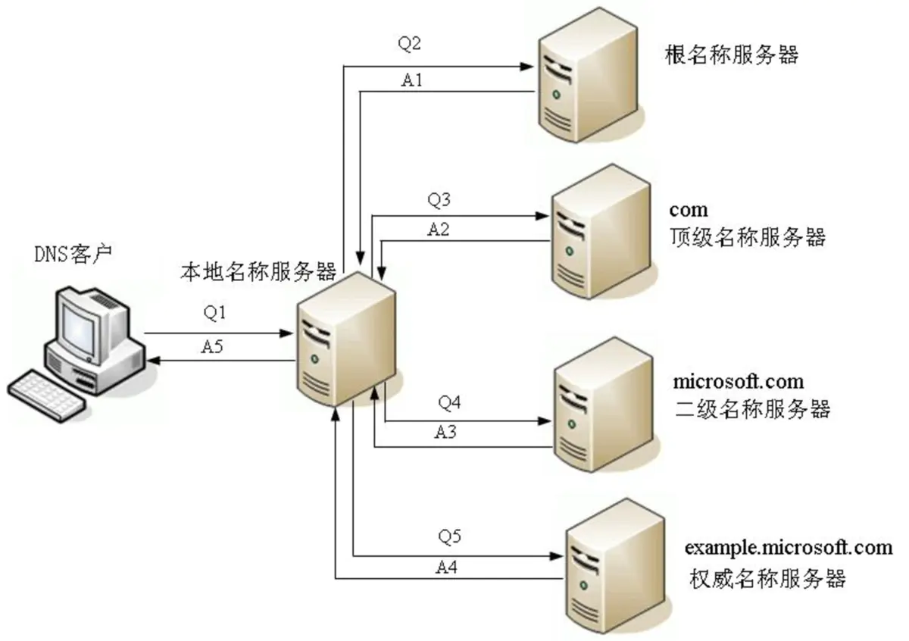

# 浏览器工作原理：从 URL 输入到页面展现到底发生了什么？

对浏览器原理有过了解的一定不会陌生这篇神文《[How Browsers Work](https://link.jianshu.com?t=https://www.html5rocks.com/en/tutorials/internals/howbrowserswork/)》中文翻译：[浏览器原理：新式网络浏览器幕后揭秘](https://link.jianshu.com?t=https://www.html5rocks.com/zh/tutorials/internals/howbrowserswork/)。另外还有一篇 《[What really happens when you navigate to a URL](https://link.jianshu.com?t=http://igoro.com/archive/what-really-happens-when-you-navigate-to-a-url/)》。大神写的东西很长很复杂，阅读成本虽然大，但能学到东西。所以，我也试着用自己的理解去写一写，算是做个巩固。里面有很多参考，如涉及版权，侵权删！表述有误，请指正！

>#### 前端为什么要研究渲染原理？

像素完美（Pixel Perfection）、分辨率无关（Resolution Independent）和多平台体验一致性是设计师的追求。而访问性（Accessability）、加载性能和重构灵活性则是前端工程师必懂的技能。最重要的加载性能又与浏览器渲染机制深深挂钩，所以只有弄明白了浏览器背后的渲染机制，才能在日常的前端开发中明白如何进行性能优化。
 还有就是像类似：
 **从输入 URL 到页面加载完成的过程中都发生了什么事情**？
 **从按下键盘到屏幕上出现字符，中间都发生了什么事情**？
 **用户反应网站卡，请问都有哪些可能性，以及解决方法**？
 这样的问题面试官都是比较喜欢问的，今天尝试来详细说一下这个过程。

> #### 从输入 URL 到页面加载完成的过程中都发生了什么？

**简单路径线**：

1. 键盘或触屏输入URL并回车确认
2. URL解析/DNS解析查找域名IP地址
3. 网络连接发起HTTP请求
4. HTTP报文传输过程
5. 服务器接收数据
6. 服务器响应请求/MVC
7. 服务器返回数据
8. 客户端接收数据
9. 浏览器加载/渲染页面
10. 打印绘制输出

实际上并没有这么简单，下面说说它的**详细路径线**：

**1. 键盘或触屏输入URL并回车确认**

当然故事其实并不是从输入一个URL或抓着鼠标点击一个链接开始的，事情的开端要追溯到服务器启动监听服务的时候，在某个未知的时刻，一台机房里普普通通的服务器，加上电，启动了操作系统，随着操作系统的就绪，服务器启动了 http 服务进程，这个 http 服务的守护进程（daemon），可能是 Apache、Nginx、IIS、Lighttpd中的一个，不管怎么说，这个 http 服务进程开始定位到服务器上的 www 文件夹（网站根目录），一般是位于 /var/www ，然后启动了一些附属的模块，例如 php，或者，使用 fastcgi 方式连接到 php 的 fpm 管理进程，然后，向操作系统申请了一个 tcp 连接，然后绑定在了 80 端口，调用了 accept 函数，开始了默默的监听，监听着可能来自位于地球任何一个地方的请求，随时准备做出响应。这个时候，典型的情况下，机房里面应该还有一个数据库服务器，或许，还有一台缓存服务器，如果对于流量巨大的网站，那么动态脚本的解释器可能还有单独的物理机器来跑，如果是中小的站点，那么，上述的各色服务，甚至都可能在一台物理机上，这些服务监听之间的关系，可以通过自己搭建一次 Apache PHP MySQL 环境来了解一下，不管怎么说，他们做好了准备，静候差遣。
 然后是开始键盘或手机触屏输入URL，然后通过某种机制传到CPU（过程略），CPU进行内部处理（过程略），处理完后，再从CPU传到操作系统内核（过程略），然后再由操作系统GUI传到浏览器，再由浏览器到浏览器内核。这个过程因为涉及很多底层的知识，自己也只是了解皮毛，过程这里不多讲了，具体请参考我的另一篇博客《[字符集历史和乱码问题](https://www.jianshu.com/p/d38a79a4f0f4)》和以下书籍：
 《[编码](https://link.jianshu.com?t=http://book.douban.com/subject/20260928/)》
 《[操作系统概念](https://link.jianshu.com?t=http://book.douban.com/subject/4289836/)》
 《[CPU自制入门](https://link.jianshu.com?t=http://book.douban.com/subject/25780703/)》
 《[计算机体系结构](https://link.jianshu.com?t=http://book.douban.com/subject/6559064/)》
 《[Linux内核设计与实现](https://link.jianshu.com?t=http://book.douban.com/subject/6097773/)》
 《[精通Linux设备驱动程序开发](https://link.jianshu.com?t=http://book.douban.com/subject/4311450/)》
 《[计算机体系结构：量化研究方法](https://link.jianshu.com?t=http://book.douban.com/subject/7006537/)》
 《[计算机组成与设计：硬件/软件接口](https://link.jianshu.com?t=http://book.douban.com/subject/10441748/)》

**2. URL 解析/DNS 查询**

接着是输入 URL 「回车」后，这时浏览器会对 URL 进行检查，这里需要对URL有个回顾，请见百科《[URL](https://link.jianshu.com?t=http://baike.baidu.com/item/url)》，完整的URL由几个部分构成：
 *协议、网络地址、资源路径、文件名、动态参数*
 *协议/模式（scheme）*是从该计算机获取资源的方式，一般有Http、Https、Ftp、File、Mailto、Telnet、News等协议，不同协议有不同的通讯内容格式，协议主要作用是告诉浏览器如何处理将要打开的文件；
 *网络地址*指示该连接网络上哪一台计算机（服务器），可以是[域名](https://link.jianshu.com?t=http://baike.baidu.com/item/域名)或者[IP地址](https://link.jianshu.com?t=http://baike.baidu.com/item/IP地址)，域名或IP地址后面有时还跟一个冒号和一个端口号；
 *端口号*如果地址不包含端口号，根据协议的类型会确定一个默认端口号。端口号之于计算机就像窗口号之于银行，一家银行有多个窗口，每个窗口都有个号码，不同窗口可以负责不同的服务。端口只是一个逻辑概念，和计算机硬件没有关系。一般如果你的端口号就是默认的，那么url是不需要输入端口号的，但如果你更改了默认端口号，你就必须要在url后输入新端口号才能正常访问。例如：http协议默认端口号是80。如果你输入的url是[http://www.zhihu.com:8080/](https://link.jianshu.com?t=http://www.zhihu.com:8080/) ，那表示不使用默认的端口号，而使用指定的端口号8080。如果使用的就是默认端口号那么输入[http://www.zhihu.com:80](https://link.jianshu.com?t=http://www.zhihu.com:80) 和[http://www.zhihu.com](https://link.jianshu.com?t=http://www.zhihu.com)是一样的。有个特殊情况有所不同，比如本地IP 127.0.0.1 其实走的是 [loopback](https://link.jianshu.com?t=http://en.wikipedia.org/wiki/Localhost)，和网卡设备没关系。
 *资源路径*指示从服务器上获取哪一项资源的等级结构路径，以斜线`/`分隔；
 *文件名*一般是需要真正访问的文件，有时候，URL以斜杠“/”结尾，而隐藏了文件名，在这种情况下，URL引用路径中最后一个目录中的默认文件（通常对应于主页），这个文件常被称为 index.html 或 default.htm。
 *动态参数*有时候路径后面会有以问号`?`开始的参数，这一般都是用来传送对服务器上的数据库进行动态询问时所需要的参数，有时候没有，很多为了seo优化，都已处理成[伪静态](https://link.jianshu.com?t=http://baike.baidu.com/item/伪静态)了。要注意区分url和[路由](https://link.jianshu.com?t=http://www.digpage.com/route.html)的区别。
 **URL完整格式为：协议://用户名:密码@子域名.域名.顶级域名:[端口号](https://link.jianshu.com?t=http://baike.baidu.com/item/端口号)/目录/文件名.文件后缀?参数=值#标志**
 例如：[https://www.zhihu.com/question/55998388/answer/166987812](https://link.jianshu.com?t=https://www.zhihu.com/question/55998388/answer/166987812)
 协议部分：https
 网络地址：[www.zhihu.com](https://link.jianshu.com?t=http://www.zhihu.com)（依次为 子/三级域名.二级域名.顶/一级域名）
 资源路径：/question/55998388/answer/166987812
 浏览器对 URL 进行检查时首先判断协议，如果是 http/https 就按照 Web 来处理，另外还会对 URL 进行安全检查，然后直接调用浏览器内核中的对应方法，接下来是对网络地址进行处理，如果地址不是一个IP地址而是域名则通过DNS（域名系统）将该地址解析成IP地址。IP地址对应着网络上一台计算机，DNS服务器本身也有IP，你的网络设置包含DNS服务器的IP。 例如：[www.zhihu.com](https://link.jianshu.com?t=http://www.zhihu.com)域名请求对应获得的IP是 116.211.167.187。DNS 在解析域名的时候有两种方式：**递归查询和迭代查询**，
 递归查询的流程如下：
 一般来说，浏览器会首先查询**浏览器缓存**（DNS 在各个层级都有缓存的，相应的，缓存当然有过期时间，Time to live），如果没有找到，就会检查**系统缓存**，检查本地硬盘的hosts文件，这个文件保存了一些以前访问过的网站的域名和IP对应的数据。它就像是一个本地的数据库。如果找到就可以直接获取目标主机的IP地址了（注意这个地方存在安全隐患，如果有病毒把一些常用的域名，修改 hosts 文件，指向一些恶意的IP，那么浏览器也会不加判断的去连接，是的，这正是很多病毒的惯用手法）。如果本地hosts也没有找到的话，则需要再向上层找**路由器缓存**，路由器有自己的DNS缓存，可能就包括了查询的内容；如果还是没有，需要接着往上找，查询**ISP DNS 缓存**（本地名称服务器缓存，就是客户端电脑TCP/IP参数中设置的首选DNS服务器，此解析具有权威性。一般情况下你在不同的地区或者不同的网络，如电信、联通、移动的情况下，转换后的IP地址很可能是不一样的，这涉及到负载均衡，通过DNS解析域名时会将你的访问分配到不同的入口，先找附近的本地 DNS 服务器去请求解析域名，尽可能保证你所访问的入口是所有入口中较快的一个，这和[CDN](https://link.jianshu.com?t=http://baike.baidu.com/item/CDN)还不一样，比如我们经常使用的114.114.114.114或Google的8.8.8.8就是本地名称服务器）。如果附近的本地DNS服务器还是没有缓存我们请求的域名记录的话，这时候会根据本地DNS服务器的设置（是否设置转发器）进行查询，如果未用转发模式，则本地名称服务器再以DNS客户端的角色发送与前面一样的DNS域名查询请求转发给上一层。这里可能经过一次或者多次转发，从**本地名称服务器**到**权威名称服务器**再到**顶级名称服务器**最后到**根名称服务器**。（顺便一提，根服务器是互联网域名解析系统DNS中最高级别的域名服务器，全球一共13组，每组都只有一个主根名称服务器采用同一个IP。注意不是13个，前期是个现在已经是集群了，据说已经有上千台了，好多台用于负载均衡，备份等，全球有386台根物理服务器，被编号为A到M共13个标号。中国包括台港也持有其中5组14台辅根服务器或叫镜像也可以，386台根服务器总共只使用了13个IP，因此可以抵抗针对其所进行的分布式拒绝服务攻击DDoS。具体情况可以参看维基百科的 [根域名服务器](https://link.jianshu.com?t=http://zh.wikipedia.org/wiki/根域名服務器) 条目）所以，最终请求到了根服务器后，根服务器查询发现我们这个被请求的域名是由类似A或者B这样的服务器解析的，但是，根服务器并不会送佛送到西地找A或B之类的直接去解析，因为它没有保存全部互联网域名记录，并不直接用于名称解析，它只是负责顶级名称服务器（如.com/.cn/.net等）的相关内容。所以它会把所查询得到的被请求的DNS域名中顶级域名所对应的顶级名称服务器IP地址返回给本地名称服务器。本地名称服务器拿到地址后再向对应的顶级名称服务器发送与前面一样的DNS域名查询请求。对应的顶级名称服务器在收到DNS查询请求后，也是先查询自己的缓存，如果有则直接把对应的记录项返回给本地名称服务器，然后再由本地名称服务器返回给DNS客户端，如果没有则向本地名称服务器返回所请求的DNS域名中的二级域名所对应的二级名称服务器（如[baidu.com/qq.com/net.cn](https://link.jianshu.com?t=http://baidu.com/qq.com/net.cn)等）地址。然后本地名称服务器继续按照前面介绍的方法一次次地向三级（如[www.baidu.com/www.qq.com/bbs.taobao.com](https://link.jianshu.com?t=http://www.baidu.com/www.qq.com/bbs.taobao.com)等）、四级名称服务器查询，直到最终的对应域名所在区域的权威名称服务器返回最终记录给本地名称服务器。同时本地名称服务器会缓存本次查询得到的记录项（每层都应该会缓存）。再层层下传，最后到了我们的DNS客户端机子，一次 DNS 解析请求就此完成。如果最终权威名称服务器都说找不到对应的域名记录，则会向本地名称服务器返回一条查询失败的DNS应答报文，这条报文最终也会由本地名称服务器返回给DNS客户端。当然，如果这个权威名称服务器上配置了指向其它名称服务器的转发器，则权威名称服务器还会在转发器指向的名称服务器上进一步查询。另外，如果DNS客户端上配置了多个DNS服务器，则还会继续向其它DNS服务器查询的。

所以，我们看到DNS的域名解析是递归的，递归的DNS首先会查看自己的DNS缓存，如果缓存能够命中，那么就从缓存中把IP地址返回给浏览器，如果找不到对应的域名的IP地址，那么就依此层层向上转发请求，从根域名服务器到顶级域名服务器再到极限域名服务器依次搜索对应目标域名的IP，最高达到根节点，找到或者全部找不到为止。然后把找到的这个域名对应的 nameserver 的地址拿到，再向这个 namserver 去请求域名对应的IP，最后把这个IP地址返回给浏览器，在这个**递归查询**的过程中，对于浏览器来说是透明的，如果DNS客户端的本地名称服务器不能解析的话，则后面的查询都会以本地名称服务器为中心，全交由本地名称服务器代替DNS客户端进行查询，DNS客户端只是发出原始的域名查询请求报文，然后就一直处于坐等状态，直到本地名称服务器最终从权威名称服务器得到了正确的IP地址查询结果并返回给它。虽然递归查询是默认的DNS查询方式，但是如果有以下情况发生的话，则会使用迭代的查询方式进行。
 情况一：DNS客户端的请求报文中没有申请使用递归查询，即在DNS请求报头部的RD字段没有置1。
 情况二：DNS客户端的请求报文中申请使用的是递归查询（也就是RD字段置1了），但在所配置的本地名称服务器上是禁用递归查询了（即在应答DNS报文头部的RA字段置0）。

**迭代查询的流程如下**：
 开始也是从浏览器缓存到系统缓存到路由缓存，如果还是没找到则客户端向本机配置的本地名称服务器（在此仅以首先DNS服务器为例进行介绍，其它备用DNS服务器的解析流程完全一样）发出DNS域名查询请求。本地名称服务器收到请求后，先查询本地的缓存，如果有该域名的记录项，则本地名称服务器就直接把查询的结果返回给客户端；如果本地缓存中没有该域名的记录，则向DNS客户端返回一条DNS应答报文，报文中会给出一些参考信息，如本地名称服务器上的根名称服务器地址等。DNS客户端在收到本地名称服务器的应答报文后，会根据其中的根名称服务器地址信息，向对应的根名称服务器再次发出与前面一样的DNS查询请求报文。根名称服务器在收到DNS查询请求报文后，通过查询自己的DNS数据库得到请求DNS域名中顶级域名所对应的顶级名称服务器信息，然后以一条DNS应答报文返回给DNS客户端。DNS客户端根据来自根名称服务器应答报文中的对应顶级名称服务器地址信息，向该顶级名称服务器发出与前面一样的DNS查询请求报文。顶级名称服务器在收到DNS查询请求后，先查询自己的缓存，如果有请求的DNS域名的记录项，则直接把对应的记录项返回给DNS客户端，否则通过查询后把对应域名中二级域名所对应的二级名称服务器地址信息以一条DNS应答报文返回给DNS客户端。然后DNS客户端继续按照前面介绍的方法一次次地向三级、四级名称服务器查询，直到最终的权威名称服务器返回到最终的记录。如果权威名称服务器也找不到对应的域名记录，则会向DNS客户端返回一条查询失败的DNS应答报文。当然，如果这个权威名称服务器上配置了指向其它名称服务器的转发器，则权威名称服务器还会在转发器指向的名称服务器上进一步查询。另外，如果DNS客户端上配置了多个DNS服务器，则还会继续向其它DNS服务器查询。

所以，我们发现在递归查询中后面的查询工作是由本地名称服务器替代DNS客户端进行的（以“本地名称服务器”为中心），只需要本地名称服务器向DNS客户端返回最终的查询结果即可。而DNS迭代查询的所有查询工作则全部是DNS客户端自己进行（以“DNS客户端”自己为中心）。

**DNS递归查询和迭代查询的区别**？
 递归查询是以本地名称服务器为中心的，是DNS客户端和服务器之间的查询活动，递归查询的过程中“查询的递交者” 一直在更替，其结果是直接告诉DNS客户端需要查询的网站目标IP地址。
 迭代查询则是DNS客户端自己为中心的，是各个服务器和服务器之间的查询活动，迭代查询的过程中“查询的递交者”一直没变化，其结果是间接告诉DNS客户端另一个DNS服务器的地址。

递归和迭代查询

 举个例子来说，一次选修课上你碰到了你的女神，但你只知道她的名字并不知道她的电话，于是在手机通讯录里找，没找到，然后你回到寝室把她名字告诉了一个很仗义的哥们，让他帮你找，这个哥们儿（本地名称服务器）二话没说，开始替你查（此处完成了一次递归查询，即问询的人由你变成了你的哥们）。然后你哥们带着名字去问了学院大四的学长，学长一看，我擦，这姑娘我认识啊，于是在手机里找到了她的电话告诉了你哥们，你哥们回来告诉了你，你于是知道了她的电话（这里一次递归查询结束）。还有一种可能你哥们跑去问学长，学长也没她电话，但学长告诉你哥们，这姑娘是xx系的；然后你哥们儿马不停蹄又问了xx系的办公室主任助理同学，助理同学说是xx系yy班的，然后很仗义的哥们儿去xx系yy班的班长那里取到了该女孩的电话（此处完成若干次迭代查询，即问询的人一直是你哥们不变，但反复更替的是问询对象）。最后，他把号码交到了你手里，完成整个查询过程。

**扩展阅读：**
 [什么是DNS劫持？](https://link.jianshu.com?t=http://baike.baidu.com/item/DNS劫持)
 [什么是301重定向？](https://link.jianshu.com?t=http://baike.baidu.com/item/301重定向)与[301重定向设置教程](https://link.jianshu.com?t=http://www.chinaz.com/web/2013/1212/330808.shtml)
 [电脑上不了网将DNS改为114.114.114.114或8.8.8.8可以解决或加快网速的原理是什么？](https://link.jianshu.com?t=https://www.zhihu.com/question/34784697)
 [局域网 IP 和公网 IP 有何差别？](https://link.jianshu.com?t=https://www.zhihu.com/question/27714563)
 [根域名服务器的作用是什么？全球 13 组根域名服务器中有 10 组在美国，意味着什么？](https://link.jianshu.com?t=https://www.zhihu.com/question/22364736)
 [递归和迭代的区别？](https://link.jianshu.com?t=https://www.zhihu.com/question/20278387)

**3. 应用层客户端发送HTTP请求**

互联网内各网络设备间的通信都遵循TCP/IP协议，利用TCP/IP协议族进行网络通信时，会通过分层顺序与对方进行通信。分层由高到低分别为：应用层、传输层、网络层、数据链路层。发送端从应用层往下走，接收端从数据链路层网上走。如图所示：

从上面的步骤中得到 IP 地址后，浏览器会开始构造一个 HTTP 请求，应用层客户端向服务器端发送的HTTP请求包括：请求报头和请求主体两个部分，其中请求报头（request header）包含了至关重要的信息，包括请求的方法（GET / POST和不常用的PUT / DELETE以及更不常用的HEAD / OPTION / TRACE，一般的浏览器只能发起 GET 或者 POST 请求）、目标url、遵循的协议（HTTP / HTTPS / FTP…），返回的信息是否需要缓存，以及客户端是否发送Cookie等信息。需要注意的是，因为 HTTP 请求是纯文本格式的，所以在 TCP 的数据段中可以直接分析 HTTP 文本的。

**4. 传输层TCP传输报文**

当应用层的 HTTP 请求准备好后，浏览器会在传输层发起一条到达服务器的 TCP 连接，位于传输层的TCP协议为传输报文提供可靠的字节流服务。它为了方便传输，将大块的数据分割成以报文段为单位的数据包进行管理，并为它们编号，方便服务器接收时能准确地还原报文信息。TCP协议通过“三次握手”等方法保证传输的安全可靠。“三次握手”的过程是，发送端先发送一个带有SYN（synchronize）标志的数据包给接收端，在一定的延迟时间内等待接收的回复。接收端收到数据包后，传回一个带有SYN/ACK标志的数据包以示传达确认信息。接收方收到后再发送一个带有ACK标志的数据包给接收端以示握手成功。在这个过程中，如果发送端在规定延迟时间内没有收到回复则默认接收方没有收到请求，而再次发送，直到收到回复为止。

 这里需要谈一下 TCP 的 Head-of-line blocking 问题：假设客户端的发送了 3 个 TCP 片段（segments），编号分别是 1、2、3，如果编号为 1 的包传输时丢了，即便编号 2 和 3 已经到达也只能等待，因为 TCP 协议需要保证顺序，这个问题在 HTTP pipelining 下更严重，因为 HTTP pipelining 可以让多个 HTTP 请求通过一个 TCP 发送，比如发送两张图片，可能第二张图片的数据已经全收到了，但还得等第一张图片的数据传到。为了解决 TCP 协议的性能问题，Chrome 团队提出了 [QUIC](https://link.jianshu.com?t=http://en.wikipedia.org/wiki/QUIC) 协议，它是基于 UDP 实现的可靠传输，比起 TCP，它能减少很多来回（round trip）时间，还有前向纠错码（Forward Error Correction）等功能。目前 Google Plus、 Gmail、Google Search、blogspot、Youtube 等几乎大部分 Google 产品都在使用 QUIC，可以通过[chrome://net-internals/#spdy](https://link.jianshu.com?t=chrome://net-internals/#spdy) 页面来发现。另外，浏览器对同一个域名有连接数限制，[大部分是 6](https://link.jianshu.com?t=http://www.browserscope.org/?category=network&v=top)，但并非将这个连接数改大后就会提升性能，Chrome 团队有做过实验，发现从 6 改成 10 后性能反而下降了，造成这个现象的因素有很多，如建立连接的开销、拥塞控制等问题，而像 SPDY、HTTP 2.0 协议尽管只使用一个 TCP 连接来传输数据，但性能反而更好，而且还能实现请求优先级。

**5. 网络层IP协议查询MAC地址**

IP协议的作用是把TCP分割好的各种数据包封装到IP包里面传送给接收方。而要保证确实能传到接收方还需要接收方的MAC地址，也就是物理地址才可以。IP地址和MAC地址是一一对应的关系，一个网络设备的IP地址可以更换，但是MAC地址一般是固定不变的。ARP协议可以将IP地址解析成对应的MAC地址。当通信的双方不在同一个局域网时，需要多次中转才能到达最终的目标，在中转的过程中需要通过下一个中转站的MAC地址来搜索下一个中转目标。

**6. 数据到达数据链路层**

在找到对方的MAC地址后，已被封装好的IP包再被封装到数据链路层的数据帧结构中，将数据发送到数据链路层传输，再通过物理层的比特流送出去。这时，客户端发送请求的阶段结束。

> 这些分层的意义在于分工合作，数据链路层通过 CSMA/CD 协议保证了相邻两台主机之间的数据报文传递，而网络层的 IP 数据包通过不同子网之间的路由器的路由算法和路由转发，保证了互联网上两台遥远主机之间的点对点的通讯，不过这种传输是不可靠，于是可靠性就由传输层的 TCP 协议来保证，TCP 通过慢开始，乘法减小等手段来进行流量控制和拥塞避免，同时提供了两台遥远主机上进程到进程的通信，最终保证了 HTTP 的请求头能够被远方的服务器上正在监听的 HTTP 服务器进程收到，终于，数据包在跳与跳之间被拆了又封装，在子网与子网之间被转发了又转发，最后进入了服务器的操作系统的缓冲区，服务器的操作系统由此给正在被阻塞住的 accept 函数一个返回，将他唤醒。

**7. 服务器接收数据**

接收端的服务器在链路层接收到数据包，再层层向上直到应用层。这过程中包括在传输层通过TCP协议将分段的数据包重新组成原来的HTTP请求报文。

**8. 服务器响应请求并返回相应文件**

服务接收到客户端发送的HTTP请求后，服务器上的的 http 监听进程会得到这个请求，然后一般情况下会启动一个新的子进程去处理这个请求，同时父进程继续监听。http 服务器首先会查看重写规则，然后如果请求的文件是真实存在，例如一些图片，或 html、css、js 等静态文件，则会直接把这个文件返回，如果是一个动态的请求，那么会根据 url 重写模块的规则，把这个请求重写到一个 rest 风格的 url 上，然后根据动态语言的脚本，来决定调用什么类型的动态文件脚本解释器来处理这个请求。

我们以 php 语言为例来说的话，请求到达一个 php 的 mvc 框架之后，框架首先应该会初始化一些环境的参数，例如远端 ip，请求参数等等，然后根据请求的 url 送到一个路由器类里面去匹配路由，路由由上到下逐条匹配，一旦遇到 url 能够匹配的上，而且请求的方法也能够命中的话，那么请求就会由这个路由所定义的处理方法去处理。

请求进入处理函数之后，如果客户端所请求需要浏览的内容是一个动态的内容，那么处理函数会相应的从数据源里面取出数据，这个地方一般会有一个缓存，例如 memcached 来减小 db 的压力，如果引入了 orm 框架的话，那么处理函数直接向 orm 框架索要数据就可以了，由 orm 框架来决定是使用内存里面的缓存还是从 db 去取数据，一般缓存都会有一个过期的时间，而 orm 框架也会在取到数据回来之后，把数据存一份在内存缓存中的。

orm 框架负责把面向对象的请求翻译成标准的 sql 语句，然后送到后端的 db 去执行，db 这里以 mysql 为例的话，那么一条 sql 进来之后，db 本身也是有缓存的，不过 db 的缓存一般是用 sql 语言 hash 来存取的，也就是说，想要缓存能够命中，除了查询的字段和方法要一样以外，查询的参数也要完全一模一样才能够使用 db 本身的查询缓存，sql 经过查询缓存器，然后就会到达查询分析器，在这里，db 会根据被搜索的数据表的索引建立情况，和 sql 语言本身的特点，来决定使用哪一个字段的索引，值得一提的是，即使一个数据表同时在多个字段建立了索引，但是对于一条 sql 语句来说，还是只能使用一个索引，所以这里就需要分析使用哪个索引效率最高了，一般来说，sql 优化在这个点上也是很重要的一个方面。

sql 由 db 返回结果集后，再由 orm 框架把结果转换成模型对象，然后由 orm 框架进行一些逻辑处理，把准备好的数据，送到视图层的渲染引擎去渲染，渲染引擎负责模板的管理，字段的友好显示，也包括负责一些多国语言之类的任务。对于一条请求在 mvc 中的生命周期，可以参考这里，[临摹了一个 PHP MVC 框架](https://link.jianshu.com?t=http://zrj.me/archives/404)，在视图层把页面准备好后，再从动态脚本解释器送回到 http 服务器，由 http 服务器把这些正文加上一个响应头，封装成一个标准的 http 响应包，再通过 tcp ip 协议，送回到客户机浏览器。

***9）浏览器开始处理数据信息并渲染页面\***

历经千辛万苦，我们请求的响应终于成功到达了客户端的浏览器，响应到达浏览器之后，浏览器首先会根据返回的响应报文里的一个重要信息——状态码，来做个判断。如果是 200 开头的就好办，表示请求成功，直接进入渲染流程，如果是 300 开头的就要去相应头里面找 location 域，根据这个 location 的指引，进行跳转，这里跳转需要开启一个跳转计数器，是为了避免两个或者多个页面之间形成的循环的跳转，当跳转次数过多之后，浏览器会报错，同时停止。比如：301表示永久重定向，即请求的资源已经永久转移到新的位置。在返回301状态码的同时，响应报文也会附带重定向的url，客户端接收到后将http请求的url做相应的改变再重新发送。如果是 400 开头或者 500 开头的状态码，浏览器也会给出一个错误页面。比如：404 not found 就表示客户端请求的资源找不到。

当浏览得到一个正确的 200 响应之后，接下来面临的一个问题就是多国语言的编码解析了，响应头是一个 ascii 的标准字符集的文本，这个还好办，但是响应的正文本质上就是一个字节流，对于这一坨字节流，浏览器要怎么去处理呢？首先浏览器会去看响应头里面指定的 encoding 域，如果有了这个东西，那么就按照指定的 encoding 去解析字符，如果没有的话，那么浏览器会使用一些比较智能的方式，去猜测和判断这一坨字节流应该使用什么字符集去解码。相关的笔记可以看这里，[字符集编码](https://www.jianshu.com/p/d38a79a4f0f4)

接下来就是构建 dom 树了，在 html 语言嵌套正常而且规范的情况下，这种 xml 标记的语言是比较容易的能够构建出一棵 dom 树出来的，当然，对于互联网上大量的不规范的页面，不同的浏览器应该有自己不同的容错去处理。构建出来的 dom 本质上还是一棵抽象的逻辑树，构建 dom 树的过程中，如果遇到了由 script 标签包起来的 js 动态脚本代码，那么会把代码送到 js 引擎里面去跑，如果遇到了 style 标签包围起来的 css 代码，也会保存下来，用于稍后的渲染。如果遇到了 img 或 css 和 js等引用外部文件的标签，那么浏览器会根据指定的 url 再次发起一个新的 http 请求，去把这个文件拉取回来，值得一提的是，对于同一个域名下的下载过程来说，浏览器一般允许的并发请求是有限的，通常控制在两个左右，所以如果有很多的图片的话，一般出于优化的目的，都会把这些图片使用一台静态文件的服务器来保存起来，负责响应，从而减少主服务器的压力。

dom 树构造好了之后，就是根据 dom 树和 css 样式表来构造 render 树了，这个才是真正的用于渲染到页面上的一个一个的矩形框的树，网页渲染是浏览器最复杂、最核心的功能，对于 render 树上每一个框，需要确定他的 x y 坐标，尺寸，边框，字体，形态，等等诸多方面的东西，render 树一旦构建完成，整个页面也就准备好了，可以上菜了。需要说明的是，下载页面，构建 dom 树，构建 render 树这三个步骤，实际上并不是严格的先后顺序的，为了加快速度，提高效率，让用户不要等那么久，现在一般都并行的往前推进的，现代的浏览器都是一边下载，下载到了一点数据就开始构建 dom 树，也一边开始构建 render 树，构建了一点就显示一点出来，这样用户看起来就不用等待那么久了。

***10）将渲染好的页面图像显示出来，并开始响应用户的操作。\***

这一步主要涉及显卡，内存及显示器原理等知识，不做详细解说，大概就是从内存到 LCD/LED，再由光线进入人眼的一个过程。

> 以上过程简单讲主要是：从输入 URL 到浏览器接收（回车前），从浏览器接收到数据如何发送给网卡（回车后），再把接收的数据从本机网卡发送到服务器，服务器接收到数据后做了怎么的处理？服务器返回数据后浏览器又做了哪些处理？浏览器又是如何将处理好的页面展现在屏幕上的？的这么一个过程。
>  但只是最基本的一些步骤，实际不可能就这么简单，一些可选的步骤例如网页缓存、连接池、加载策略、加密解密、代理中转等等都没有提及。即使基本步骤本身也有很复杂的子步骤，TCP/IP、DNS、HTTP、HTML等等，还需要考虑很多情况，比如广播、拆包解包合并包丢包重传、路由表，NAT、TCP 状态机、CDN、HTTPS 证书校验与中间人攻击检测、RSA 密钥协商、AES 加解密、浏览器解析 HTTP 的有限自动状态机、GUI 库与绘图、OpenGL 绘图、GPU 加速（OpenCL 与 CUDA）、JIT（JavaScript 会把 JavaScript 代码编译成汇编代码）、服务器的数据库 NoSQL 或 SQL 查询、主从数据库同步、服务器和浏览器的内存管理（WebKit 实现的 fastMalloc()，服务器上可能是 TCMalloc 或者 JeMalloc）、服务器上的语言解释器（可能也是 JIT）、多媒体：傅里叶变换、H.264 解码（硬件解码，硬件解码的话 GPU 的处理单元又在计算.......或软件解码）、音频解码、WebGL 绘图、浏览器的 Sandbox、服务器的 SQL 注入检查、产生的键盘中断信号处理（或者是高级层面的输入输出驱动）、网卡驱动、网络栈的 TCP FastOpen、SYN Cookie 之类众多技术……每一个都可以展开成庞大的课题，而浏览器的基础——操作系统、编译器、硬件等更是一个比一个复杂。即便是计算机专业的同学看了也会头大，但我保证这里面的每一个步骤都经过深思熟虑和时间的考验的，并不是谁闲的蛋疼非要搞得那么复杂，不复杂也不行啊。你输入URL即可浏览互联网，而计算机系统在背后做了无数你看不到的工作，计算机各个子领域无数工程师为此付出了你难以想象的努力。有兴趣的可以阅读下
>  [你刚才在淘宝上买了一件东西](https://link.jianshu.com?t=http://kb.cnblogs.com/page/132716/)

浏览器解析渲染页面原理